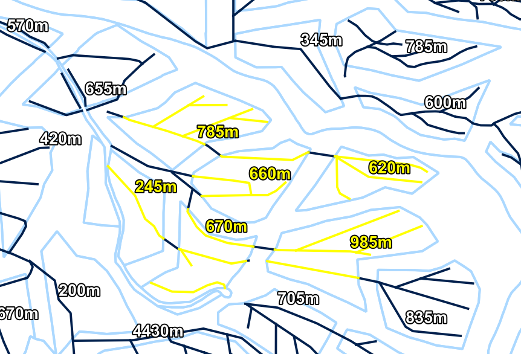

  

This plugin accurately calculates the length of lines contained within each polygon. The calculated distance depends on the coordinate reference system (CRS) of the input layer. To get accurate distances, it is recommended to use a projected coordinate system in meters. Even if a line spans multiple polygons, the line is split at the polygon boundaries so that the length is not calculated twice. However, if the line completely coincides with the polygon boundary (for example, if it overlaps exactly along the boundary), the line may not be processed correctly. This is due to the specifications of the geometry intersection test and split processing.

  

